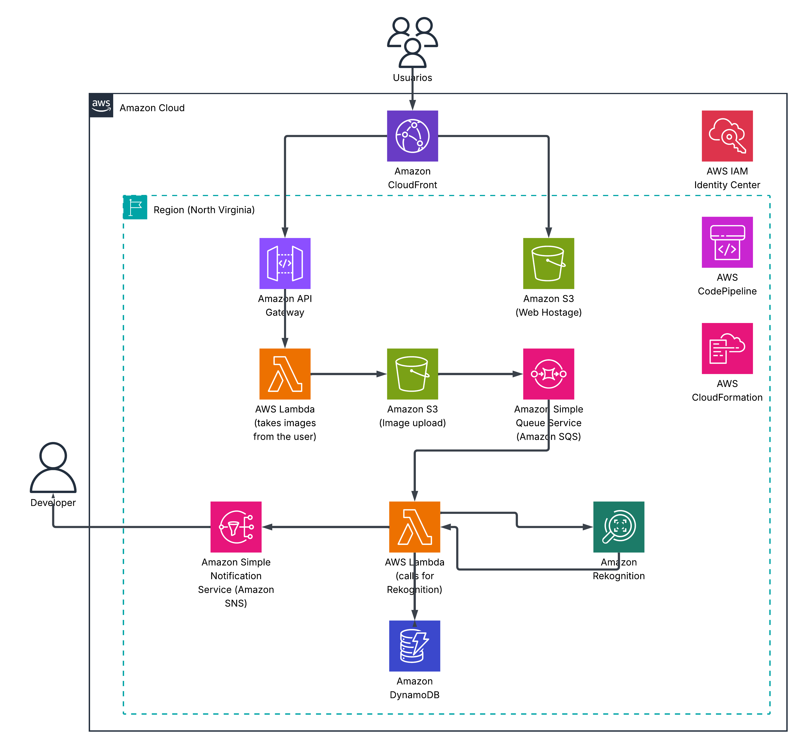

# alerts-celebrities-AWS
Este repositorio contiene un template de CloudFormation que despliega una arquitectura en AWS destinada a la detección de celebridades en imágenes subidas por cualquier usuario a través de una página web estática.

